-----------------------
Proposal for Confocal
-----------------------

A package for modelling light intensity profile in a confocal microscope using Huygens-Fresnel principle.

https://github.com/ankit7540/Confocal

Problem to solve
################

Confocal microscopes achieve looking at a specific plane in some object which can be a liquid or a living cell. This 2D plane has a finite thickness
which governs the volume observed by the microscope. In spectroscopic applications, the volume of the medium observed by the confocal
microscope is important (as in my reasearch). Determination of this volume by theoretical modelling is the aim of the present work. Applications of this volume are numerous, such as, estimation of intrinsic property of molecules to give some signal, which can 
be determined if the concentration in a liquid and the confocal volume is known.

The problem is shown using simple figure below.

**Field** : Optics, Spectroscopy

**Theory** : Huygens-Fresnel principle

**Algorithm** : 3D integrals of complex valued functions (for numerical integration, Gauss-Legendre Quadrature or similar implementations)

Perspective users
################

Researchers using confocal microscopes

System architecture
################

General idea:

 1. There are 5-8 number of parameters required to model a microscope. Plan to used some defaults and some user input values to set up the calculation. ( For example, mesh/grid density defined using step size for setting up matrix representing 3D space, focal length of lenses, wavelength of light, and integral limits) 

 2. Next, is the sanity check for the parameters to be valid within physical limits.
 
 3. Do computation (integration)
 
 4. Print different level of results based on earlier used input.
 
 

 
Flowcharts:
----------

    
Analyze how your system takes input, produces results, and performs any other operations.

Describe the system's work flow. You may consider to use a flow chart but it is not required.

Specify the constraints assume in your system. Describe how it is modularized.

API description
################

**Pure python implementation :**

Defined functions are

 * excitn
(real output, desc : intensity of excitation beam in the object medium )

 * ampl_splane
(complex output, desc : scattering amplitude from a point in the scattering plane )

 * ampl_oplane
(complex output, desc : scattering amplitude from all point from object medium, includes double integral)

**C++/PyBind implementation :**

These have not been explicitly defined in the program yet. But general scheme is as for the pure python implementation.

 * excitn
(real output, desc : intensity of excitation beam in the object medium )

 * ampl_splane 
(complex output, desc : scattering amplitude from a point in the scattering plane )

 * ampl_oplane
(complex output, desc : scattering amplitude from all point from object medium, includes double integral)

Numerical integration : Quadpack 

**Version control**

Git

**Documentation**

Github markdown

**Others**
Build system, CI and others have been planned yet.

Schedule
################

+------------+--------------------+-------------+
| Type       | Core computation   | Time frame  |
+============+====================+=============+
| Pure python| SciPy              | 2-4 weeks   |
+------------+--------------------+-------------+
| With C++   | PyBind, C++        |remaining    |
+------------+--------------------+-------------+

References
################

1. Confocal volume in laser Raman microscopy depth profiling, Yutaka Maruyama & Wataru Kanematsu, *Journal of Applied Physics*, 110, 103107, **2011** (pdf_file_)

.. _pdf_file: https://overclocked.space/index.php/s/u0W3hv48ktj01KU
